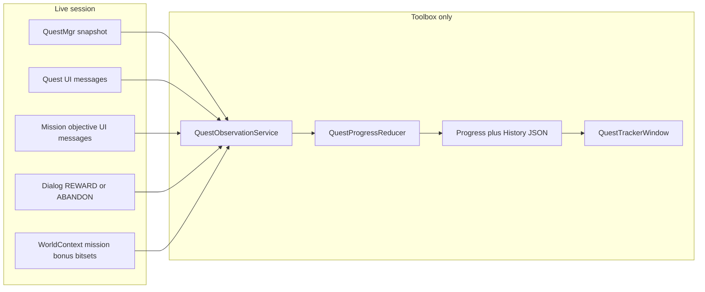

# Quest Tracker Feasibility Investigation

## Verdict

**Yes for a safe MVP; no for a complete permanent quest-completion archive from the game alone.**

- Live snapshot + UI events are rich enough for read-only list, selected quest, in-log completion flags, objectives, add/remove observation, and mission/bonus bitsets from GWCA.
- `GW::Quest::log_state` / `Quest::IsCompleted()` expose completion **for quests currently present in the quest log**. What is **not** reliably available is permanent historical turn-in/reward completion after the quest leaves the log, or while Toolbox was offline.
- Disappearance / `kQuestRemoved` alone must stay unknown. Correlated abandon/reward evidence stays confidence-aware (probable until contract + runtime validation allow promotion).
- Aligns with [docs/contracts/quest_progress_contract_v1.md](docs/contracts/quest_progress_contract_v1.md) and repo confidence/boundary rules.

`CompletionWindow` is a **reference implementation** only (persistence and bitset parsing patterns). Mission/bonus data enters the tracker via GWCA `WorldContext` bitsets (or a separately owned observation adapter), not via a runtime dependency on `CompletionWindow`.

## Deliverables (docs only; STOP before any code)

Write these four files after plan approval (create `docs/quest-tracker/` and `docs/quest-tracker/plans/`):

1. [docs/quest-tracker/repository-investigation.md](docs/quest-tracker/repository-investigation.md) — modules, lifecycle, registration, build/test
2. [docs/quest-tracker/data-availability.md](docs/quest-tracker/data-availability.md) — reliability matrix per concern
3. [docs/quest-tracker/proposed-architecture.md](docs/quest-tracker/proposed-architecture.md) — services, stores, confidence, ownership, throttling
4. [docs/quest-tracker/plans/quest-tracker-mvp.md](docs/quest-tracker/plans/quest-tracker-mvp.md) — phased MVP plan ending with **STOP**

No edits under `GWToolboxdll/`, GWCA, CMake, or other production paths in this investigation phase.

---

## Key evidence (to cite in docs)

### Existing Toolbox surfaces
| Component | Paths | Role vs tracker |
|-----------|-------|-----------------|
| `QuestModule` | [GWToolboxdll/Modules/QuestModule.h](GWToolboxdll/Modules/QuestModule.h), [.cpp](GWToolboxdll/Modules/QuestModule.cpp) | Pathing/custom marker/`ParseQuestObjectives`; **not** progress UI. Filter `custom_quest_id = 0xfdd`. |
| `ActiveQuestWidget` | [Widgets/ActiveQuestWidget.*](GWToolboxdll/Widgets/ActiveQuestWidget.cpp) | Display pattern for active quest vs mission objectives (`qid == -1`) |
| `CompletionWindow` | [Windows/CompletionWindow.*](GWToolboxdll/Windows/CompletionWindow.cpp) | **Reference only** for per-character JSON and `ParseCompletionBuffer`-style bitset reads; no runtime coupling |
| `DialogModule::QuestDialogType` | [Modules/DialogModule.h](GWToolboxdll/Modules/DialogModule.h) | `TAKE`/`REWARD`/`ENQUIRE_REWARD` for correlated turn-in pairing |
| Registration | [ToolboxSettings.cpp](GWToolboxdll/Modules/ToolboxSettings.cpp) `optional_modules` → `GWToolbox::ToggleModule` | Expected minimal production touch for new window/module |

### GWCA observation APIs
- Snapshot: `GW::QuestMgr::{GetQuestLog,GetQuest,GetActiveQuestId,RequestQuestInfoId}`; `GW::Quest::{log_state,objectives,IsCompleted}`; `WorldContext::{quest_log,active_quest_id,mission_objectives,missions_completed,_bonus,_hm}`
- Normal quest UI events (trigger fresh `GetQuestLog()` snapshot; not sole authority): `kQuestAdded`, `kQuestDetailsChanged`, `kQuestRemoved`, plus active-quest messages as needed
- Mission objective UI events (relate to `WorldContext::mission_objectives`; trigger mission-objective snapshot): `kObjectiveAdd`, `kObjectiveComplete`, `kObjectiveUpdated`
- Other: `kSendAbandonQuest`, `kMissionComplete`/`kVanquishComplete`/`kDungeonComplete`, `kMapLoaded`/`kStartMapLoad` in [UIMessages.h](Dependencies/GWCA/include/GWCA/Constants/UIMessages.h)
- StoC: typed `QuestAdd`; `QUEST_REMOVE` opcode exists but **no typed struct** — prefer UI `kQuestRemoved` then snapshot
- Identity: preferred key `account_uuid` (`GW::AccountMgr::GetAccountUuid`) + `character_uuid` (`CharContext::player_uuid`); character name is display metadata and fallback only when UUID is temporarily unavailable — **do not** auto-merge records by name alone

### Persistence / build / tests
- Settings: `SettingsDoc` under `Documents/GWToolboxpp/<PC>/configs/.../modules/`
- Long-lived data pattern: `Resources::GetPath` + glaze JSON (pattern inspired by Completion; owned file, not shared with Completion)
- Build: `cmake --preset=vcpkg` / `cmake --build build --config RelWithDebInfo` ([README.md](README.md))
- Source globbing: [GWToolboxdll/CMakeLists.txt](GWToolboxdll/CMakeLists.txt) globs Module/Window sources — **new Module/Window files likely need no CMake source-list edit**; CMake changes only if/when a separate test target is added later
- Testing: existing `TestHarness` is an **in-game development harness**, not a CTest unit-test framework. The pure reducer must be designed unit-testable; concrete test integration is a **Phase 2 decision** — do not commit to a new test executable in this investigation

---

## Reliability matrix (core of data-availability.md)

| Concern | Reliability | Method | Notes |
|---------|-------------|--------|-------|
| Character / account | confirmed (session) | `account_uuid` + `character_uuid` (`CharContext::player_uuid`); name display/fallback only | Re-bind on map load / identity change; no name-only merge |
| Quest log | confirmed (snapshot) | Fresh `GetQuestLog()` after quest UI events / map load | Invalid during load; filter `0xfdd` |
| Selected quest | confirmed | `GetActiveQuestId` + active-quest UI msgs | Auto-select on add possible |
| In-log quest completion | confirmed (while present) | `log_state` / `Quest::IsCompleted()` on current log entry | Means ready/completed **in log**, not permanent history |
| Normal quest objectives | confirmed when present | Snapshot after `kQuestDetailsChanged`/`kQuestAdded`/`kQuestRemoved`; parse objectives / `0x2af5` | Events trigger snapshot; null objectives → throttled `RequestQuestInfoId`, not empty |
| Mission objectives | confirmed for instance UI | Snapshot `WorldContext::mission_objectives` after `kObjective*` | Separate channel from quest-log objectives; clears on map leave |
| Quest added | confirmed (presence) | `kQuestAdded` then snapshot | |
| Disappearance / remove | presence loss confirmed; outcome unknown | `kQuestRemoved` then snapshot | **Never** treat as completion |
| Correlated abandon | probable (pending validation) | `kSendAbandonQuest` paired with removal | Not unconditional proof |
| Correlated reward/turn-in | probable (pending validation) | REWARD / ENQUIRE_REWARD dialog paired with removal | Do not promote to fully confirmed completion unless contract explicitly permits and runtime traces validate |
| Historical / offline completion | unknown | local history / manual / import only | Cannot reconstruct remotions while Toolbox offline |
| Mission/bonus maps | confirmed via GWCA bitsets | Own adapter reading `missions_completed` / `_bonus` / `_hm` (+ completion UI msgs as refresh triggers) | Not via `CompletionWindow`; mission maps ≠ quest log |
| Character switch | confirmed on UUID change | switch store by `account_uuid + character_uuid` | |
| Offline reconstruction | remotions unknown | later snapshot vs last store | Diffs → unknown/uncertain transitions only; never auto-complete |

### Completion kinds (must distinguish in docs)

1. **Completion observed while still in the quest log** — `IsCompleted()` / `log_state & 0x2`; source `game_snapshot`; confidence confirmed for that observation.
2. **Correlated reward/turn-in** — dialog + removal pairing; confidence probable until contract + runtime validation allow stronger claims.
3. **Unknown historical/offline completion** — quest absent vs prior store with no evidence; never invent `completed_*`.

---

## Proposed architecture (proposed-architecture.md)

Follow [.cursor/skills/add-quest-observation/SKILL.md](.cursor/skills/add-quest-observation/SKILL.md):

- **`QuestObservationService`** — sole owner of all HookEntries; lightweight callbacks copy into owned observation structs; never retain GWCA pointers beyond the callback/frame; no disk I/O inside callbacks; queue work for Update/game-thread processing
- **`QuestProgressReducer`** — pure logic: owned observations → immutable events → state; unit-testable by design; never collapses uncertain→confirmed; keeps quest-log and mission-objective channels separate
- **`QuestProgressStore` / `QuestHistoryStore`** — keyed by `account_uuid + character_uuid`; name as metadata; append-only history; JSON via `Resources::GetPath` (owned file)
- **`QuestTrackerWindow`** — new `ToolboxWindow`; display only; register in `optional_modules`
- **Mission/bonus adapter** — separately owned reader of GWCA completion bitsets (CompletionWindow is reference for how, not a dependency)

### Lifecycle / ownership (document explicitly)

| Hook | Behavior |
|------|----------|
| `Initialize` | Register UI callbacks once; create HookEntries owned by ObservationService; no persistence yet beyond settings load path |
| `Update` | Drain observation queue; apply reducer; throttle/dedupe `RequestQuestInfoId`; schedule persistence off callback path |
| `SignalTerminate` | Unregister callbacks; stop requesting quest info; flush pending owned state safely |
| `Terminate` | Release HookEntries; clear owned caches; ensure no dangling GWCA pointers |

### `RequestQuestInfoId` throttling

- Track per-quest last-request time and in-flight / already-requested set
- Do not request every frame when `objectives` is null
- Skip synthetic `custom_quest_id` (`0xfdd`)
- Deduplicate concurrent triggers from multiple UI messages

### Confidence for abandon / reward

- `kSendAbandonQuest` + removal → correlated abandonment (`probable`), not unconditional proof
- REWARD dialog + removal → correlated turn-in (`probable`), pending runtime validation
- Disappearance alone → always unknown
- Do not promote these to fully confirmed completion unless [quest_progress_contract_v1.md](docs/contracts/quest_progress_contract_v1.md) explicitly permits and runtime traces validate the evidence

### Upstream touches (production, later)

- Expected minimal: [ToolboxSettings.cpp](GWToolboxdll/Modules/ToolboxSettings.cpp) registration only
- Prefer new Module/Window/helper files (picked up by source globbing)
- CMake changes deferred to a possible later separate test target — not assumed for MVP modules/windows

States/sources/confidence match contract v1 where applicable: `active`, `objective_progress`, `ready_for_reward` (in-log `IsCompleted`), `abandoned_observed`, `completed_observed` (only under contract-permitted evidence), `completed_manual`; sources `game_snapshot`/`game_event`/`mission_completion_data`/`manual_user_input`/`imported_history`.

---

## MVP phases (plans/quest-tracker-mvp.md)

### Phase 1 — Read-only list / objectives
- Observe quest log via events → fresh `GetQuestLog()` snapshot; active quest; in-log `IsCompleted` / objectives
- Keep mission objectives on a separate path (`kObjective*` → `mission_objectives` snapshot)
- UI list with objective bullets (reuse parse helpers; do not mutate quest log)
- Throttle/dedupe `RequestQuestInfoId`
- ObservationService owns HookEntries; copy-out observations; no persistence beyond settings
- Verify: map load, switch active quest, in-log completion flag, mission mode separate, ignore custom marker

### Phase 2 — Per-character persistence / history
- Persist under `account_uuid + character_uuid`; name metadata / UUID-unavailable fallback only; no name-only auto-merge
- Append history for add / objective change / in-log ready_for_reward / remove-as-unknown / abandon-probable / reward-probable
- Load last snapshot on login; offline diffs marked unknown/uncertain; never auto-completed
- Own mission/bonus bitset observation (not CompletionWindow)
- Malformed/old-version JSON parser tests planned as pure-logic tests
- **Test integration decision**: document reducer as unit-testable; choose concrete harness/target separately (do not assume new test executable yet). Clarify TestHarness ≠ CTest

### Phase 3 — Export / manual corrections / Codex
- Export/import envelope per [quest_progress_contract_v1.md](docs/contracts/quest_progress_contract_v1.md)
- Manual mark complete/abandon with `confidence=manual`
- Include `mission_completion_data` from owned GWCA bitset reads (separate from quest-log states)
- Idempotent import; reject unsupported major schema versions

### Explicit non-goals
- Automate take/abandon/reward/travel/combat; fabricate completion from disappearance; runtime dependency on CompletionWindow; mass upstream refactors; dependency updates; committing to a new test executable in this investigation

### STOP
After the four docs are written and this plan is approved for later implementation: **STOP. Do not implement.**
