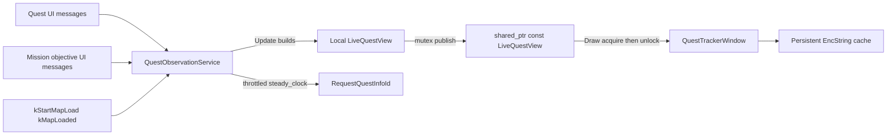

# Phase 1 — Live read-only quest tracker

## Goal

Add a minimal, observation-only Toolbox window that shows the **current character’s live quest log**, **selected quest**, and **objective text / completion flags**, using fresh GWCA snapshots after UI events. Align with [docs/quest-tracker/plans/quest-tracker-mvp.md](docs/quest-tracker/plans/quest-tracker-mvp.md) Phase 1 and [proposed-architecture.md](docs/quest-tracker/proposed-architecture.md).

## Non-goals (explicit)

- Persistence, history, export/import, manual corrections, Codex envelope
- `QuestProgressReducer` / `QuestProgressStore` / `QuestHistoryStore`
- Mission/bonus map bitsets / CompletionWindow coupling
- Abandon/reward correlation, confidence promotion, character UUID stores
- Automating take/abandon/reward/travel/combat; mutating the quest log
- Editing `QuestModule`, `ActiveQuestWidget`, `CompletionWindow`, GWCA, or CMake
- Unit-test executable / CTest target
- Custom Phase 1 settings (no `LoadSettings` / `SaveSettings` overrides)

## Chosen design (Phase 1)

- **`QuestObservationService`**: non-module helper that **owns all HookEntries**, runs a deterministic dirty/loading state machine, builds a complete `LiveQuestView` on the game thread, **publishes an immutable snapshot** for Draw, throttles `RequestQuestInfoId`.
- **`QuestTrackerWindow`**: registered `ToolboxWindow` singleton that drives service lifecycle, holds a **persistent `EncString` decode cache**, and draws one acquired immutable snapshot.
- **No reducer/store yet** — published immutable `LiveQuestView` is the Phase 1 state.
- Do **not** call `QuestModule::ParseQuestObjectives` (unthrottled `RequestQuestInfo`). Reimplement encode-split/`0x2af5` parse against owned `std::wstring` copies.
- Snapshot publication uses a **mutex-protected `std::shared_ptr<const LiveQuestView>`** (concrete choice; no existing `atomic<shared_ptr>` pattern in-repo).



## Exact files

### New files

| File | Role |
|------|------|
| [GWToolboxdll/Modules/QuestObservationService.h](GWToolboxdll/Modules/QuestObservationService.h) | Service API + owned snapshot types |
| [GWToolboxdll/Modules/QuestObservationService.cpp](GWToolboxdll/Modules/QuestObservationService.cpp) | Hooks, state machine, publish, throttle, teardown |
| [GWToolboxdll/Windows/QuestTrackerWindow.h](GWToolboxdll/Windows/QuestTrackerWindow.h) | `ToolboxWindow` singleton + decode-cache members |
| [GWToolboxdll/Windows/QuestTrackerWindow.cpp](GWToolboxdll/Windows/QuestTrackerWindow.cpp) | Lifecycle + read-only ImGui |

CMake: no change — [GWToolboxdll/CMakeLists.txt](GWToolboxdll/CMakeLists.txt) already GLOBs `Modules/*` and `Windows/*`.

### Existing file to modify (only)

| File | Change |
|------|--------|
| [GWToolboxdll/Modules/ToolboxSettings.cpp](GWToolboxdll/Modules/ToolboxSettings.cpp) | `#include <Windows/QuestTrackerWindow.h>`; add `QuestTrackerWindow::Instance()` to `optional_modules` (near other Windows, e.g. beside `CompletionWindow` / `DailyQuests`) |

No other production edits unless build proves an include dependency (none expected).

---

## Owned snapshot model

Copy into a **local** `LiveQuestView` during `Update`; never keep `GW::Quest*`, game `wchar_t*`, or array pointers past the snapshot function. **Do not** put `GuiUtils::EncString` inside the published snapshot.

```cpp
struct OwnedObjective {
    std::wstring encoded;   // copied objective segment for later EncString::reset
    bool completed = false; // leading 0x2af5 for quest objs
};

struct OwnedQuestEntry {
    GW::Constants::QuestID quest_id = GW::Constants::QuestID::None;
    uint32_t log_state = 0;
    bool in_log_completed = false; // Quest::IsCompleted() at snapshot time
    std::wstring name_encoded;     // copy of quest->name or empty
    std::vector<OwnedObjective> objectives;
    bool objectives_missing = false;
};

struct OwnedMissionObjective {
    uint32_t objective_id = 0;
    std::wstring enc;
    uint32_t type = 0;
    bool bullet = false;
    bool completed = false; // type & 0x2
};

struct LiveQuestView {
    uint64_t revision = 0;           // monotonically increasing on each successful publish
    bool loading = false;            // true while map-load / world not ready for a valid view
    bool world_ready = false;        // true only after a successful full snapshot while ready
    GW::Constants::QuestID active_quest_id = GW::Constants::QuestID::None;
    bool mission_mode = false;       // (int32_t)active == -1
    std::vector<OwnedQuestEntry> quests;
    std::vector<OwnedMissionObjective> mission_objectives;
};
```

**Filter:** skip `quest_id == (QuestID)0x0000fdd` (QuestModule custom marker).

**Defaults:** `active_quest_id` is always initialized/assigned as `GW::Constants::QuestID::None` (`0`), never left uninitialized.

---

## Thread-safe immutable snapshot publication

`ToolboxModule::Update` runs on the **game thread**; `Draw` runs in the **render/ImGui** context. The service must **not** mutate vectors that Draw is reading.

**Publish path (`Update`, game thread):**

1. Build a complete `LiveQuestView` in a **local** (stack/unique) object — mutate only this local.
2. Wrap as `std::shared_ptr<const LiveQuestView>` (move the completed local into the shared object).
3. Under a short mutex: assign the service’s published pointer to this new shared_ptr (replace previous).
4. Never expose a mutable `LiveQuestView&` to the window.

**Draw path (render thread):**

1. Under the same mutex: copy the `shared_ptr<const LiveQuestView>` (bump refcount).
2. **Release the mutex immediately.**
3. Render exclusively from that `const LiveQuestView` via the held `shared_ptr`.
4. If the pointer is null, draw empty/loading UI.

API shape: `std::shared_ptr<const LiveQuestView> QuestObservationService::AcquireSnapshot() const;` — lock, copy shared_ptr, unlock; return. No mutable reference accessor.

---

## Deterministic initial / map-loading state machine

Dirty channels (at minimum): `quest_log_dirty`, `active_quest_dirty`, `mission_objectives_dirty`.

| Event / step | Behavior |
|--------------|----------|
| `Initialize` | Register callbacks; set **all three channels dirty**; ensure an initial snapshot is attempted even if the map is already loaded |
| `kStartMapLoad` | Publish (or mark for immediate publish) a **loading-invalid** view: `loading=true`, `world_ready=false`, clear quest/mission vectors, `active_quest_id = QuestID::None`, bump revision; leave **all channels dirty** |
| `kMapLoaded` | Mark **all channels dirty**; do **not** assume the loading screen is gone — do not clear dirty solely because of this message |
| `Update` when dirty | If world **not** ready (`IsLoadingScreenShown`, null world context, and/or instance loading per existing GWCA checks): **keep dirty flags set**; keep/publish loading-invalid state as needed; do not clear dirty |
| First world-ready frame | Detect readiness with the same GWCA map/loading checks; snapshot **all** channels into one local `LiveQuestView` (`loading=false`, `world_ready=true`); publish; **then** clear dirty flags |
| Successful partial refresh | When only some channels dirty and world ready: snapshot dirty channels into a new local view (copy unchanged channels from previous published const view), publish, clear only those dirty flags |
| Failed / skipped snapshot | Dirty flags **remain set** |

Clear dirty flags **only after a successful snapshot** that was published (or successfully merged into a published view).

---

## Persistent EncString decoding ownership

`GuiUtils::EncString` is stateful, asynchronous, **non-copyable**, and must **not** be recreated every Draw frame.

- Immutable snapshot holds only raw `std::wstring` encodings.
- `QuestTrackerWindow` owns a persistent decode cache:
  - quest names keyed by `quest_id`;
  - quest objectives keyed by `(quest_id, objective_index)`;
  - mission objectives keyed by `objective_id`.
- On each Draw (after acquiring a snapshot): for each needed key, `EncString::reset(encoded.c_str())` **only when** the cached encoded source differs; otherwise reuse the existing decoder and call `string()` / `wstring()`.
- After a snapshot `revision` change: remove stale cache entries whose keys no longer exist in the new view.
- `Terminate`: destroy/clear **all** decode cache objects.

---

## Observation / snapshot policy

Callbacks only set dirty flags (and optional throttle bookkeeping). **Authoritative data comes from snapshots in `Update`.**

| Channel | UI triggers | Snapshot action |
|---------|-------------|-----------------|
| Quest log | `kQuestAdded`, `kQuestDetailsChanged`, `kQuestRemoved` | Fresh `GetQuestLog()`; copy fields; parse objectives from copied strings |
| Active quest | `kClientActiveQuestChanged`, `kServerActiveQuestChanged` | `GetActiveQuestId()`; `mission_mode = ((int32_t)id == -1)`; else store id (`None` when none) |
| Mission objectives | `kObjectiveAdd`, `kObjectiveComplete`, `kObjectiveUpdated` | Copy `WorldContext::mission_objectives` (`OBJECTIVE_FLAG_BULLET=0x1`, `COMPLETED=0x2`) |
| Map load start | `kStartMapLoad` | Loading-invalid publish + all dirty (see state machine) |
| Map loaded msg | `kMapLoaded` | All dirty; wait for world-ready before clearing |

**Events are not authoritative by themselves.**

---

## `RequestQuestInfoId` throttle / dedupe

When a log entry has `objectives_missing`:

- Clock: **`std::chrono::steady_clock`** for last-request timestamps
- Per-`quest_id`: last request time + “requested since last details” flag
- Cooldown: **2 seconds** minimum between requests for the same id
- Coalesce: multiple dirty events in one frame → at most one request per id in that `Update`
- Skip `0xfdd`, loading / non-ready world, invalid context
- On `kQuestDetailsChanged` for that id: clear “in-flight” so a later missing snapshot can retry after cooldown
- Never call from Draw or from UI callback body (only from `Update` after a successful snapshot attempt while world-ready)
- Suppress quest notification audio around the request the same way QuestModule does (`AudioSettings::BlockSoundForMs` on the quest-sound encodings used by `BlockQuestSound` in [QuestModule.cpp](GWToolboxdll/Modules/QuestModule.cpp)) — call `AudioSettings` directly; do not edit QuestModule

---

## Lifecycle

### `QuestTrackerWindow`

| Method | Behavior |
|--------|----------|
| `Initialize` | `ToolboxWindow::Initialize()`; `observation_.Initialize()` (marks all dirty) |
| `Update` | `observation_.Update(delta)` |
| `Draw` | If `visible`: `auto snap = observation_.AcquireSnapshot()`; sync decode cache to `snap`; render; no GWCA |
| `SignalTerminate` | **Idempotent:** `observation_.SignalTerminate()` then base |
| `Terminate` | **Idempotent:** clear EncString decode cache; `observation_.Terminate()`; base |
| `LoadSettings` / `SaveSettings` | **Do not override** — inherited ToolboxWindow / UI-element settings handle visibility and geometry |

### `QuestObservationService`

| Method | Behavior |
|--------|----------|
| `Initialize` | Idempotent-safe: register UI callbacks once (guard if already registered); set all channels dirty |
| `Update` | Run loading/ready state machine; build local view when dirty and allowed; publish immutable snapshot; throttle requests; clear dirty only after success |
| `SignalTerminate` | **Idempotent:** if callbacks registered, `RemoveUIMessageCallback`; mark terminated so further Update/requests no-op; safe if called after partial init |
| `Terminate` | **Idempotent:** ensure callbacks removed; clear HookEntries, throttle maps; publish/reset empty snapshot under mutex; safe if `SignalTerminate` already ran or init never completed |

Callbacks: lightweight, no throw, no disk I/O, no GWCA pointer stash.

---

## Read-only UI (fixed layout — no ambiguity)

Window name: `"Quest Tracker"`; icon e.g. `ICON_FA_SCROLL`.

`Draw` always uses this structure:

1. **Quest name list** — one row per quest in the snapshot; highlight the row whose `quest_id == active_quest_id` (when not `mission_mode`); show an in-log completed badge when `in_log_completed` (label as ready / in-log completed — **not** permanent history). **No objective bullets inline in this list.**
2. **Active quest details** — separate section below the list: objectives for the **active quest only** (lookup by `active_quest_id` in `quests`). If none selected (`QuestID::None`) or active quest missing from log, show a short empty state. Completed objectives grayed (ActiveQuestWidget-style colors allowed).
3. **Mission objectives** — separate section, shown when `mission_mode` is active (and/or mission objectives present while in mission mode). Fed only from `mission_objectives`. When `mission_mode`, this is the selected/active objective display.
4. If `snap->loading` or `!snap->world_ready`: status text (“Loading…”) instead of inventing quest rows.

No buttons that send abandon / set-active / travel. Read-only.

---

## Patterns to mirror (call sites, not edits)

- Registration: [ToolboxSettings.cpp](GWToolboxdll/Modules/ToolboxSettings.cpp) `optional_modules` + include (same as `DropTrackerWindow`)
- Window base: [ToolboxWindow.h](GWToolboxdll/ToolboxWindow.h)
- UI callback register/remove: [ActiveQuestWidget.cpp](GWToolboxdll/Widgets/ActiveQuestWidget.cpp), [QuestModule.cpp](GWToolboxdll/Modules/QuestModule.cpp)
- Mission flag bits / `qid == -1`: [ActiveQuestWidget.cpp](GWToolboxdll/Widgets/ActiveQuestWidget.cpp) `Update`
- Objective parse markers: [QuestModule.cpp](GWToolboxdll/Modules/QuestModule.cpp) `ParseQuestObjectives` (`0x2`, `0x10a`, `0x2af5`) — reimplement against owned strings
- Quest sound block around info request: [QuestModule.cpp](GWToolboxdll/Modules/QuestModule.cpp) `BlockQuestSound` / `AudioSettings`
- EncString decode: [EncString.h](GWToolboxdll/Utils/EncString.h)

---

## Build

```text
cmake --preset=vcpkg
cmake --build build --config RelWithDebInfo
```

Compilation alone does not verify game-state behavior.

---

## Manual in-game verification (required)

- [ ] Enable **Quest Tracker** in Toolbox Modules; window opens
- [ ] Enable the module **after the map is already loaded** → initial quest list appears (Initialize dirty path)
- [ ] After map load / zone, list matches quest log and **excludes** custom marker `0xfdd`
- [ ] Changing active quest updates list highlight; details section shows **that quest’s objectives only**
- [ ] Objective bullets update after objective progress (`kQuestDetailsChanged` path); complete vs incomplete correct
- [ ] In-log completed/`IsCompleted` shown without implying permanent turn-in history
- [ ] Entering a mission with objectives: **mission section** updates via `kObjective*`; quest-log list stays separate and uncorrupted
- [ ] When active id is `-1` (`mission_mode`), mission section is the active objective display
- [ ] Set/clear QuestModule custom marker: tracker does not show synthetic quest as real progress
- [ ] Quests missing objectives: throttled `RequestQuestInfoId` via `steady_clock` (not every frame); details appear after fetch
- [ ] **No repeated quest sound / notification** caused by `RequestQuestInfoId` (audio block works)
- [ ] Zone: `kMapLoaded` may arrive **before** loading screen disappears → dirty stays set; first world-ready frame snapshots correctly; no crash; no completion inferred from clears
- [ ] Repeated **enable/disable** cycles: idempotent teardown/init; no leftover callbacks; decode cache cleared on terminate
- [ ] While quests change, **Update and Draw** run concurrently without crashes or corrupted/torn rows (immutable snapshot publish)
- [ ] Disable module / terminate: clean teardown

---

## Risks

| Risk | Mitigation |
|------|------------|
| Update/Draw data race | Mutex-published `shared_ptr<const LiveQuestView>`; Draw copies ptr then unlocks |
| EncString every frame | Persistent window decode cache; `reset` only on encoded change |
| Encoded strings change underfoot | Copy wchars into snapshot `std::wstring` during snapshot only |
| `ParseQuestObjectives` side-effect requests | Do not call it; own parse + `steady_clock` throttle + audio block |
| Custom marker pollution | Always filter `0xfdd` |
| Mission vs quest confusion | Separate vectors; fixed UI sections |
| `kMapLoaded` before load UI gone | Dirty retained until world-ready; loading-invalid view |
| Enable mid-map | Initialize marks all dirty |
| Callback re-entrancy / throw | Dirty flags only in callbacks; no I/O; no throw |
| Partial init / double teardown | Idempotent `SignalTerminate` / `Terminate` |
| Dual HookEntry mistakes | Single service owns all entries |

---

## Deferred to Phase 2+

UUID-keyed persistence/history, abandon/reward correlation, mission/bonus bitsets, reducer unit tests, export/manual/Codex.

## Phase B3 note (documentation only)

Quest Progress Contract v1 docs are synchronized from GuildWarsCodex (`docs/contracts/`). This does **not** implement an exporter, history persistence, or start a new implementation phase by itself. Observation capabilities remain subject to [data-availability.md](docs/quest-tracker/data-availability.md) and [capability notes](docs/contracts/quest_progress_contract_v1_toolbox_capability_notes.md). Next implementation work requires separate approval.

---

## STOP

This is the Phase 1 **implementation plan only**. Do not write production files until explicitly approved.

**STOP**
