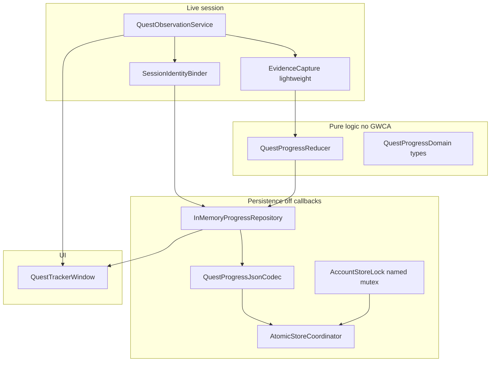

# Quest Tracker Phase 2 — Persistence Plan (revised)

**Status:** Phase 2 plan finalized; Batch 2A foundation landed (`21eb1c8e`); Batch 2A.1 review hardening in progress
**Branch:** `feature/quest-tracker-phase-2-persistence`
**Planning todos:** plan doc written; MVP pointer updated; docs commit precedes Batch 2A.

---

## Starting state (verified)

- Branch: `feature/quest-tracker-phase-2-persistence`
- HEAD / merge-base with `quest-tracker`: `8c5ca8c8a20ad2ef26cab3c2ca28c34f1e330c45`
- Working tree: clean at planning time
- No branch switches or merges for this planning task

---

## Goals / non-goals

**Goals**

- Per-character persistent progress + append-only history
- Pure, deterministic observation→history reducer (unit-testable offline)
- Versioned JSON store under Toolbox computer folder with Windows-safe atomic replace
- One store file per account; cross-process safe writes
- Character-switch isolation; offline gaps never fabricate completion
- Internal model maps cleanly to Contract v1 for Phase 3 (no export yet)
- Stable internal `semanticEventKey` / event identity in Phase 2

**Non-goals**

- Contract export/import / Codex I/O
- Prerequisite-based completion inference
- CompletionWindow / GWCA / dependency / unrelated CMake changes (except approved `QuestProgressTests` target)
- Treating tracker click / “currently selected quest” as persistent progress
- Durable records without validated character UUID
- Automatic `FallbackNameOnly` persistence
- Phase 3

---

## Investigated evidence (summary)

### Identity

| Piece | API | Classification |
|-------|-----|----------------|
| Account UUID | `GW::AccountMgr::GetAccountUuid()` ([ToolboxUtils](GWToolboxdll/Utils/ToolboxUtils.h)) | Game/portal when available; else email-hash GUID (not a secret, but not portal UUID) |
| Character UUID | `CharContext::player_uuid[4]` ([CharContext.h](Dependencies/GWCA/include/GWCA/Context/CharContext.h)); also `AvailableCharacterInfo::uuid[4]` | **Game-provided field present**; **no production consumer yet**; rename survival **unproven in-repo** |
| Display name | `GetCurrentPlayerName()` / `player_name` | Metadata only; rename-unstable |
| Profession | `AvailableCharacterInfo::primary()` | Metadata |
| Pre-Searing | `GW::Map::IsPreSearing` / char map_id | Metadata |
| Switch detect | Diff account+character GUID after world-ready `kMapLoaded`; optional `kLogout` requests final flush |

Existing stores (Completion, AccountInventory) key by **name** — do **not** copy that for quest progress.

### Persistence patterns

- Durable non-settings data: `Resources::GetPath(...)` → `Documents/GWToolboxpp/<PC>/`
- No shared atomic JSON writer; Completion uses truncating `ofstream` (crash-unsafe)
- Closest rename pattern: `TexmodModule` temp→rename — **insufficient alone**; Phase 2 requires `ReplaceFileW` + `.bak`
- `SettingsDoc` for UI prefs only
- **No CTest**; `TestHarness` is in-game only

### Phase 1 observation (reuse)

- [`QuestObservationService`](GWToolboxdll/Modules/QuestObservationService.h): immutable `LiveQuestView`, dirty SM, throttle — **extend with evidence flags**, do not move persistence into [`QuestTrackerWindow`](GWToolboxdll/Windows/QuestTrackerWindow.cpp)
- UI: `kQuestAdded/Removed/DetailsChanged`, active-quest msgs, `kObjective*`, `kStartMapLoad`/`kMapLoaded`, `kSendAbandonQuest`, `kSendDialog` + `DialogModule::QuestDialogType::{REWARD,ENQUIRE_REWARD,TAKE}`
- Mission bits: `WorldContext::missions_*` (owned adapter; CompletionWindow reference only)

### Contract note

Normative fields are Contract v1 in [quest_progress_contract_v1.md](docs/contracts/quest_progress_contract_v1.md). Capability notes remain non-normative.

---

## Chosen identity strategy

```text
characterKey = GuidToString(account_uuid) + "/" + GuidToString(character_uuid)
```

Rules:

1. **Persistent character creation requires a validated non-zero character UUID** (and available account UUID for the account file key).
2. **UUID unavailable or all-zero ⇒ ephemeral in-memory session only.** No disk create, no durable character record, no history flush for that session identity.
3. **No automatic `FallbackNameOnly` durable records.** Display name is metadata only when UUID is valid.
4. **Any future manual-link / reconcile UI is deferred** (not Phase 2) and must be an explicit user action — never silent merge by name.
5. **In-game gate (Batch 2C):** verify UUID non-zero when world-ready, matches char-select `AvailableCharacterInfo::uuid` for current name, and survives rename; until verified, document rename as uncertain.

No emails or credentials in the store.

---

## Component ownership



| Component | Role | Thread |
|-----------|------|--------|
| `QuestObservationService` | Snapshots + mark dirty; Phase 2 stamps owned evidence (abandon/reward dialog **with quest id**) | Callbacks lightweight — no disk I/O |
| `SessionIdentityBinder` | Bind only when character UUID validated non-zero; else ephemeral | Update |
| `QuestProgressReducer` | Pure `reduce(prev, input) → next + history deltas` | Any (tests) |
| `InMemoryProgressRepository` | Per-character maps; dirty / heartbeat flags | Update |
| `QuestProgressJsonCodec` | Parse/serialize/major.minor migrate | Update path |
| `AtomicStoreCoordinator` | Per-account path; lock; tmp+flush+ReplaceFileW; .bak | Orderly Update / Terminate — **not** SignalTerminate body |
| `AccountStoreLock` | Windows named mutex per account key | Around load/save RMW |
| `MissionCompletionObserver` | Normalized mapId mission records | Update |
| `QuestTrackerWindow` | Read live snap + read-only history/status; **no disk** | Draw |

---

## Domain model (internal store)

### Layout on disk

```text
Resources::GetPath(L"QuestProgress")/
  <accountKey>.json          # primary
  <accountKey>.json.bak      # last successful replace backup
  <accountKey>.json.tmp      # same-directory write staging (not durable API)
```

- **One store file per account key** — not one global `quest_progress.json` for all clients.
- `accountKey` = `GuidToString(account_uuid)` (filesystem-safe GUID string).
- Filename uses the GUID string only (no email).

### Envelope (major.minor)

```json
{
  "storeFormat": "gwtoolbox-quest-progress",
  "storeVersion": { "major": 1, "minor": 0 },
  "accountKey": "<guid>",
  "characters": [ ... ]
}
```

Version rules:

| Condition | Behavior |
|-----------|----------|
| Missing / empty file | Start empty account store in memory; do not delete anything |
| Primary malformed | Attempt load of `.bak`; if `.bak` loads, use it; **never delete** primary or `.bak` on failed recovery |
| Unsupported newer **major** | Reject load **without modification** of any file; keep last-good memory or empty; UI diagnostic |
| Supported older **minor** | Explicit migrate in codec to current minor |
| Write failure mid-replace | Leave primary and `.bak` intact; keep dirty in memory |

### Per character / quest

Per character: `characterKey`, `displayName`, `profession`, `isPreSearing`, `firstObservedAt`, `lastObservedAt`, `quests[]`, `missions[]`  
Per quest: `gameQuestId`, `state`, `source`, `confidence`, `firstObservedAt`, `lastObservedAt`, `completedAt?`, `objectives[]`, `history[]`  
Per history event: `semanticEventKey`, `eventType`, `observedAt`, `state`, `source`, `confidence`, optional objectives/payload

### Domain states

| State | Phase 2 reducer |
|-------|-----------------|
| `unknown` | May produce |
| `active` | May produce (“present in quest log”) |
| `objective_progress` | May produce |
| `ready_for_reward` | May produce |
| `completed_observed` | May produce (only with exact reward pairing → `probable`) |
| `abandoned_observed` | May produce (only with exact abandon pairing → `probable`) |
| `available` | **Reserved** — reducer must never produce; invariant tests |
| `completed_manual` | **Reserved** — reducer must never produce; invariant tests |

**Critical:** GW “selected active quest” (`LiveQuestView::active_quest_id`) is **transient UI**. Tracker clicks MUST NOT append history. Progress state `active` means “observed present in quest log,” not “currently selected.”

### Mission records (normalized)

Persist **not** raw GWCA bit vectors. Persist:

```text
missions[]: { mapId, completedNormal, completedHard, bonusNormal, bonusHard, lastObservedAt }
```

Derived from owned copies of `WorldContext::missions_*` bitsets via mapId enumeration; source `mission_completion_data`.

---

## History identity and idempotence

### Objective fingerprint

```text
objectiveFingerprint = hash(
  for each objective in stable index order:
    index, isComplete, normalizedEncodedContentFingerprint
)
```

- `normalizedEncodedContentFingerprint` = hash of normalized encoded (wchar/enc) content bytes after defined normalization (trim NULs / stable encoding); empty content → distinct sentinel.
- Index + completion alone is insufficient when text changes without completion flip.

### semanticEventKey (Phase 2 — required)

Stable internal event id, deterministic from:

```text
semanticEventKey = hash(
  gameQuestId, eventType, state, source, confidence,
  objectiveFingerprint, evidenceKind
)
```

- **Does not include `characterKey`.** Phase 2 keys are per-character history identity and MUST only be compared within a single character record.
- Cross-character / global event identity would require adding `characterKey` (or account+character scope) in a later phase if needed.
- Timestamp is excluded.
- Stored on every appended history row in Phase 2 (not deferred to Phase 3).
- Phase 3 may later expose Contract `eventId` (e.g. SHA-256 hex) derived from the same inputs; Phase 2 keeps an internal stable key (FNV-1a-64 hex).
- UTF-16 objective content fingerprints hash native-endian code units — local/internal only; MUST NOT become a cross-platform Contract fingerprint without canonical byte encoding.

### Objective canonicalization

- Objectives are sorted by `(index, completed, content_fingerprint)` before keying.
- Duplicate indices are allowed only after deterministic canonicalization; duplicate-index input order MUST NOT change `semanticEventKey`.
- Duplicate indices set a diagnostic (`duplicate_objective_indices`).

### Idempotence rules

1. Unchanged snapshot vs previous reduce input → **no history append**, **no immediate disk dirty** for progress content.
2. Duplicate semantic event (same `semanticEventKey` already present in quest history) → skip append.
3. `lastObservedAt`-only refresh → see heartbeat policy below (not an immediate write).

### Late exact evidence upgrades

Exact same-quest abandon/REWARD evidence may arrive in a **later** `Reduce` after presence-loss already recorded `unknown`/`uncertain`:

- Evaluate actionable evidence **before** the repeated presence-loss short-circuit.
- `unknown`/`uncertain` + matching Abandon → `abandoned_observed` / `probable`.
- `unknown`/`uncertain` + matching REWARD + history previously showed `ready_for_reward` → `completed_observed` / `probable` with `completedAt`.
- `ENQUIRE_REWARD` alone never completes.
- Non-matching evidence never upgrades another quest.
- Duplicate late evidence is idempotent (no duplicate history rows).

### Conflicting evidence policy

- Multiple actionable evidence rows for the **same** quest in one input (`Abandon` + `Reward`) are a **conflict**.
- Emit diagnostic; **do not** silently pick by vector order.
- Disappeared quest falls back to `unknown`/`uncertain` (no abandon/complete inference).
- Duplicate identical actionable rows (e.g. two `Abandon`) are not a conflict.
- `ENQUIRE_REWARD` is non-actionable and ignored for conflict detection.

### Timestamp input contract

- Reducer timestamps MUST be canonical UTC ISO-8601 with fixed-width fields and `Z` suffix: `YYYY-MM-DDTHH:MM:SS.sssZ`.
- Non-canonical / malformed timestamps are rejected with diagnostic; history is not modified.
- Batch 2C `SessionIdentityBinder` / input adapters MUST normalize to this form before calling `Reduce`.
- Lexicographic compare is used only after canonical validation (no locale-dependent parsing in the reducer).

---

## Reducer rules (A–N)

Input: `{ previous CharacterProgress?, LiveQuestView snap, EvidenceQueue, utcNow, sessionIdentity }`  
Output: `{ next CharacterProgress?, appended Events[], diagnostics, contentChanged, touchLastObserved }`

If session identity is ephemeral (no valid UUID): reduce into ephemeral memory only; `contentChanged` never schedules disk for that identity.

| Case | Rule |
|------|------|
| A First in log | Insert quest; state `active` / `objective_progress` / `ready_for_reward` from flags; `source=game_snapshot`, `confidence=confirmed`; history observation with `semanticEventKey` |
| B Unchanged content | May set `touchLastObserved`; **no** history append; **no** content dirty |
| C Objectives change | state `objective_progress` (unless ready); append if new `semanticEventKey` |
| D In-log completed flag | state `ready_for_reward`; confirmed snapshot; append |
| E Disappear, no exact pair | state `unknown`; confidence `uncertain`; **no** completedAt; append `presence_lost` |
| F Abandon pair | Exact same `gameQuestId`: abandon evidence + remove (same or later Reduce) → `abandoned_observed`, `game_event`, `probable` |
| G Reward pair | Exact same `gameQuestId`: **REWARD** + remove of ready quest (same tick) OR late REWARD while `unknown` after history showed ready → `completed_observed`, `game_event`, `probable`. **`ENQUIRE_REWARD` alone is not turn-in evidence.** Conflicting Abandon+Reward → unknown, no inference. |
| H Map load/unload | Expire unpaired pending evidence → unknown/uncertain; no invented completion |
| I Toolbox disable/enable | Load account store under lock; offline gap (L) |
| J Relogin | Rebind identity; L for missing quests |
| K Character switch | Request flush for previous durable character; bind other key; never merge by name |
| L Offline / session gap | Advisory `session_gap` context only; missing quests use the **same** safe unknown/uncertain policy as bare disappearance; new → first observe; no auto-complete |
| M Mission | Update normalized `missions[]` by mapId; not quest disappearance |
| N Dup | Identical snap/evidence → no-op |

**Never:** promote `uncertain`→`confirmed`; never emit `available` or `completed_manual`; never treat selection click as progress; filter `0xfdd`.

### Transition table (quest progress)

| From \ Event | Observe present | Objectives change | Ready flag | Remove no pair | Remove + abandon id | Remove + REWARD id | Remove + ENQUIRE only |
|--------------|-----------------|-------------------|------------|----------------|---------------------|--------------------|------------------------|
| (none) | → active/obj/ready | — | — | — | — | — | — |
| active | touch | → objective_progress | → ready_for_reward | → unknown | → abandoned_observed | → completed_observed* | → unknown |
| objective_progress | touch | append if fp changes | → ready_for_reward | → unknown | → abandoned_observed | → completed_observed* | → unknown |
| ready_for_reward | touch | — | touch | → unknown | → abandoned_observed | → completed_observed* | → unknown |
| unknown | → active/… | — | — | touch | — | — | — |
| abandoned_observed | → active/… (re-take) | — | — | — | — | — | — |
| completed_observed | → active/… (re-observe) | — | — | — | — | — | — |

\* `completed_observed` only at `probable`, and only with exact quest-id REWARD pairing.

---

## Evidence / confidence table

| Evidence | Trigger | Exact quest id required | Window | Result | Notes |
|----------|---------|-------------------------|--------|--------|-------|
| Add | `kQuestAdded` + snap | yes (from snap) | — | presence confirmed | |
| Details | `kQuestDetailsChanged` + snap | yes | — | objective/ready confirmed | |
| Remove only | `kQuestRemoved` + snap | yes | — | unknown/uncertain | Never complete |
| Abandon | `kSendAbandonQuest` **for quest Q** then remove **Q** | **yes — same Q** | configurable (default 5s; validate in-game) | abandoned_observed / probable | Dialog/type without matching id → no pair |
| Reward turn-in | `kSendDialog` **REWARD** for quest Q then remove **Q** that was ready | **yes — same Q** | configurable (default 5s; validate) | completed_observed / probable | |
| Enquire only | `ENQUIRE_REWARD` | n/a | — | **not** turn-in | May inform UI only; does not complete |
| Arbitrary ready disappear + dialog type | mismatched / missing id | — | — | unknown/uncertain | Insufficient |
| Conflicting Abandon+Reward same id | both actionable kinds | yes | — | unknown/uncertain | Order-independent; diagnostic; no inference |
| Mission | bitset→mapId delta | mapId | — | mission record confirmed | |

Pending evidence is owned POD (quest id + type + timestamp) in ObservationService; resolved in Update → reducer. Incomplete evidence expires to unknown. Pairing window is a named constant/setting; **pending runtime validation** before tightening confidence.

---

## Persistence / atomic write (Windows-safe)

**Rejected design:** bare `std::filesystem::rename` overwrite without backup/flush guarantees.

**Required write sequence** (same directory):

1. Acquire `AccountStoreLock` (see mutex naming below).
2. Under lock: re-read primary (or `.bak` if primary malformed). Merge-on-write (below). **Always re-read after acquiring a mutex that may have been abandoned** (previous owner crashed) so in-memory assumptions are not stale.
3. Serialize account store to memory.
4. Create/write `<accountKey>.json.tmp` in the same `QuestProgress` directory.
5. `FlushFileBuffers` on the temp file handle.
6. Close temp handle.
7. **First-file creation fallback vs replace:**
   - If the primary store file **does not exist yet:** promote tmp with `MoveFileExW(tmp, primary, MOVEFILE_WRITE_THROUGH)` (no `.bak` yet — there is nothing to back up). This is the only approved `MoveFileExW` path.
   - If the primary **already exists:** `ReplaceFileW(primary, tmp, backup=<accountKey>.json.bak, REPLACEFILE_WRITE_THROUGH)`. The `.bak` backup parameter is **required**.
8. Release lock.
9. On any failure after step 3: leave primary and `.bak` untouched; retain in-memory dirty; log diagnostic. **Never delete primary or `.bak` on failed recovery.**

Do **not** use bare `std::filesystem::rename` overwrite as the durable replace path.

### Cross-process safety (chosen)

**Named mutex + under-lock re-read + character-key merge** — not an unprotected global file.

**Mutex naming:** Windows named-mutex names are restricted; raw GUID strings with `{`, `}`, `-` are awkward and case-variant. Use a **normalized hash-based** name:

```text
mutexName = "Local\\GWToolbox.QuestProgress." + hex(FNV-1a-64(UTF-8 accountKey))
```

- Hash input is the canonical account GUID string (same form used in filenames).
- Hex digest keeps the name short, charset-safe, and stable across processes.
- Collision assumption: 64-bit FNV-1a birthday risk is acceptable for the small number of concurrent Toolbox account keys on one machine; filename identity remains the account GUID string, not the mutex hex.

**Abandoned mutex:** if `WaitForSingleObject` succeeds after the previous owner died, Windows may grant ownership of an abandoned mutex (`WAIT_ABANDONED`). Treat that as success **and mandatory disk re-read** before merge/write (same as normal acquire). Do not skip re-read because “we still hold in-memory state.”

Lock / merge rules:

1. Every load/save RMW for an account file takes the account named mutex (finite wait, e.g. 2s).
2. If lock not acquired: **skip write**; keep dirty; UI/diagnostic “store locked by another GWToolbox process”; **no silent overwrite**.
3. Under lock before write: re-read disk (always, including after `WAIT_ABANDONED`). For each `characterKey`:
   - If only on disk → keep disk character.
   - If only in memory (dirty) → keep memory.
   - If both → merge: union `history[]` by `semanticEventKey`; for quest fields prefer the side with newer `lastObservedAt` when content differs; never drop unique history keys.
4. Mission records merge by `mapId` (OR completion flags if either side true; timestamps max).

This prevents two GWToolbox processes from silently clobbering each other.

### Write churn / heartbeat

| Trigger | History | Disk dirty |
|---------|---------|------------|
| Content/state/objective/mission change | maybe append | yes (debounced ~1s idle) |
| Unchanged snapshot | no | **no** immediate write |
| `lastObservedAt` only | no | **throttled heartbeat** only (e.g. ≤1 write / 5 min / character) **or** session-boundary flush (character switch, logout, orderly terminate, explicit SaveSettings) |
| Session boundary with durable identity | no new events required | final safe flush of pending heartbeat + content |

---

## Termination

| Hook | Allowed | Forbidden |
|------|---------|-----------|
| `SignalTerminate` | Stop intake (ignore new evidence/snaps); set `final_flush_requested` | Blocking disk I/O; ReplaceFileW; mutex waits that block the callback thread |
| Orderly `Update` after flag | Perform synchronous safe flush (lock + atomic replace) once | — |
| `Terminate` | If flush still pending and Update will not run, perform final synchronous safe flush here as last resort | Assuming SignalTerminate already flushed |

---

## Contract v1 mapping (Phase 3 later)

| Internal | Contract v1 | Loss |
|----------|-------------|------|
| `characterKey` | `characterKey` | Lossless |
| `displayName` | `displayName` | Lossless |
| `isPreSearing` | `isPreSearing` | Lossless |
| `gameQuestId` | `gameQuestId` | Lossless |
| `state` / `source` / `confidence` | same enums | Lossless if within allowed combos; never emit reserved states from Phase 2 reducer |
| `firstObservedAt` / `lastObservedAt` | `firstObservedAt` / `observedAt` | Lossless |
| `completedAt` | only when completed_* justified | — |
| `semanticEventKey` / history | `history[]` (+ Contract `eventId` in Phase 3) | Phase 3 may re-encode key as SHA-256 |
| `missions[]` mapId records | `mission_completion_data` shaping | Phase 3 |
| Selected quest id | **not exported as progress** | — |

`probable` × `game_event` allowed; do not emit `completed_observed`+`confirmed` from dialog pairing until validated.

---

## Exact file list (implementation later)

**New (preferred)**

- `GWToolboxdll/Modules/QuestProgressDomain.h`
- `GWToolboxdll/Modules/QuestProgressReducer.h/.cpp`
- `GWToolboxdll/Modules/QuestProgressJsonCodec.h/.cpp`
- `GWToolboxdll/Modules/QuestProgressStore.h/.cpp` (memory + coordinator)
- `GWToolboxdll/Modules/QuestSessionIdentity.h/.cpp`
- `GWToolboxdll/Modules/MissionCompletionObserver.h/.cpp`
- `GWToolboxdll/Utils/AtomicJsonFile.h/.cpp` (FlushFileBuffers + ReplaceFileW + .bak)
- `GWToolboxdll/Utils/AccountStoreLock.h/.cpp` (named mutex)
- `tests/QuestProgressTests/main.cpp` (phased cases)
- CMake target `QuestProgressTests` when Batch 2A approved

**Modify**

- `QuestObservationService.*` — evidence queue with **quest ids** only (justify)
- `QuestTrackerWindow.*` — read-only history/status UI (Batch 2D)
- `GWToolboxdll/CMakeLists.txt` or root — **only** for `QuestProgressTests`
- Docs: this plan; MVP pointer

**Do not modify:** GWCA, CompletionWindow, QuestModule (call-only), dependencies

---

## Implementation batches

| Batch | Deliverable | Exit |
|-------|-------------|------|
| **2A** | Domain types + identity structs + reducer + **domain/reducer tests only** (no disk, no codec) | `QuestProgressTests` green for 2A cases; reserved-state invariants |
| **2B** | JsonCodec major.minor + AtomicJsonFile + AccountStoreLock + merge-on-write + malformed/.bak fixtures | Codec + atomic-store tests green; no live GW |
| **2C** | SessionIdentityBinder (ephemeral vs durable) + ObservationService evidence + Store wiring + debounce/heartbeat + character switch + termination flush path | RelWithDebInfo build; in-game identity/switch checklist |
| **2D** | MissionCompletionObserver (mapId records) + tracker history/diagnostics UI + full in-game Phase 2 checklist | Persistence survives relog/switch; no false completions |

---

## Test strategy

**Chosen:** Win32 console target `QuestProgressTests` (no GWCA/ImGui/DLL).

### Split

| Batch | Linked sources | Cases |
|-------|----------------|-------|
| 2A | `QuestProgressDomain`, `QuestProgressReducer` only | first observe; idempotent duplicate; objective fp (index+completion+content); ready; bare disappear; exact abandon pair; exact REWARD pair; ENQUIRE-only ≠ complete; mismatched id ≠ pair; offline gap; character key isolation; **never emit `available` / `completed_manual`**; no selection-click history; semanticEventKey stability |
| 2B | + `QuestProgressJsonCodec`, `AtomicJsonFile`, lock/merge helpers | malformed primary → .bak; never delete on failed recovery; newer major rejected unmodified; older minor migrated; ReplaceFileW/.bak behavior (temp dir fixtures); merge-on-write union by semanticEventKey; heartbeat does not imply content churn |

### Exact run command (document for CI/local)

```powershell
cmake --preset=vcpkg
cmake --build build --config RelWithDebInfo --target QuestProgressTests
D:\Development\C++\GWToolboxpp\bin\RelWithDebInfo\QuestProgressTests.exe
# CMAKE_RUNTIME_OUTPUT_DIRECTORY is <repo>/bin/<config>/
echo $LASTEXITCODE   # must be 0
```

Non-zero process exit ⇒ batch failed; do not declare Phase 2 batch complete.

`TestHarness` remains in-game only.

---

## Build commands (future production batches)

```text
cmake --preset=vcpkg
cmake --build build --config RelWithDebInfo --clean-first
cmake --build build --config RelWithDebInfo --target GWToolboxdll
cmake --build build --config RelWithDebInfo --target QuestProgressTests
D:\Development\C++\GWToolboxpp\bin\RelWithDebInfo\QuestProgressTests.exe
```

Note: `--clean-first --target GWToolboxdll` can remove `GWToolbox.exe`; rebuild `GWToolbox` if needed for in-game checks.

---

## In-game Phase 2 checklist (after 2C/2D)

- [ ] UUID key non-zero; same after rename (gate)
- [ ] Zero/missing UUID ⇒ no durable file rows created
- [ ] Two chars similar names keep separate characterKeys
- [ ] Two Toolbox processes same account ⇒ no silent clobber (lock or merged history)
- [ ] Relog restores progress/history
- [ ] Character switch isolates data
- [ ] Objective / ready updates append once (semanticEventKey)
- [ ] Unchanged observe does not spam disk writes
- [ ] Remove without exact evidence → unknown, not completed
- [ ] Abandon exact id → abandoned probable
- [ ] REWARD exact id → completed probable; ENQUIRE alone does not
- [ ] Tracker click does not append history
- [ ] Corrupt primary falls back to .bak; files not deleted
- [ ] Newer major store rejected without modification
- [ ] Mission mapId records update independently of quest log
- [ ] SignalTerminate does not block on disk; orderly flush persists dirty store

---

## Rollback / safety

- Atomic first-create (`MoveFileExW`) / replace (`ReplaceFileW` + required `.bak`)
- Hash-based account mutex; always re-read after acquire including abandoned mutex
- Never delete primary/`.bak` on failed recovery
- Reject unsupported major without modification
- Per-account files + named mutex + merge-on-write
- Reducer never invents completion; reserved states never emitted
- Ephemeral sessions never create durable characters
- Feature remains optional (disabled-by-default registration)

---

## Unresolved items needing approval before / during implementation

1. **Character UUID rename survival** — must pass in-game gate; if fails, durable tracking blocked until product decides on deferred manual-link UI
2. **`QuestProgressTests` CMake target** — confirm adding CMake in Batch 2A
3. **Promoting reward/abandon pairing to `confirmed`** — stay `probable` in Phase 2 until runtime traces
4. **Pairing window default (5s)** — configurable; confirm after runtime validation
5. **Heartbeat interval (proposed 5 min)** — confirm during 2C if too chatty/quiet

---

## Planning checklist

- [x] Canonical plan written (`.cursor/plans/quest_tracker_phase_2_persistence.plan.md`)
- [x] MVP pointer updated (`docs/quest-tracker/plans/quest-tracker-mvp.md`)
- [x] First-file `MoveFileExW` vs existing `ReplaceFileW` documented
- [x] Hash-based mutex naming + abandoned-mutex re-read documented
- [x] Batch 2A reducer foundation landed
- [x] semanticEventKey scoped per-character (no characterKey in key); compare only within character
- [x] Late exact evidence, conflict rejection, duplicate-index canonicalization, UTC timestamp contract documented

### Batch 2B persistence reminders (not implemented yet)

- First file creation: `MoveFileExW(tmp, final, MOVEFILE_WRITE_THROUGH)`
- Replacing existing file: `ReplaceFileW(final, tmp, bak, ...)` with required `.bak`
- Mutex: `Local\GWToolbox.QuestProgress.<normalized-guid-or-fixed-length-hash>` (FNV-1a-64 hex of account key)
- Abandoned mutex acquisition requires: re-read primary → validate → try `.bak` if necessary → merge only after recovery validation

## STOP (planning / Batch 2A.1)

Batch 2B (JSON codec / atomic store) is a separate approved implementation phase.
