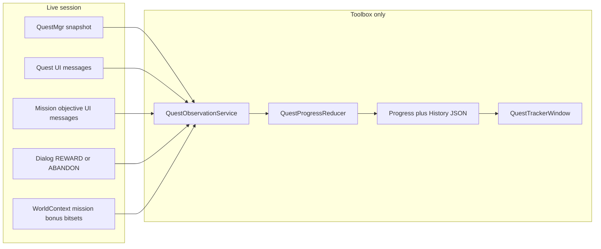

# Proposed architecture — quest tracker

Observation-only design for a safe in-game quest tracker. Follows [.cursor/skills/add-quest-observation/SKILL.md](../../.cursor/skills/add-quest-observation/SKILL.md), [data-availability.md](data-availability.md), and [quest_progress_contract_v1.md](../contracts/quest_progress_contract_v1.md).

**This document is design only. No production code is implied as implemented.**

## Goals and non-goals

**Goals**

- Observe quest log, active quest, in-log completion flags, objectives, and mission/bonus bitsets.
- Persist per-character history with source + confidence.
- Export/import compatible with Codex contract v1.
- Stay within quest-tracker boundaries (observation + local persistence + manual correction).

**Non-goals**

- Automate take / abandon / reward / travel / combat / dialogue.
- Fabricate completion from disappearance.
- Runtime dependency on `CompletionWindow`.
- Mass upstream refactors or dependency updates.

## Component diagram



Mission/bonus data enters through GWCA bitsets (or a separately owned adapter), **not** through `CompletionWindow`.

## Components

### `QuestObservationService`

Sole owner of all `GW::HookEntry` / UI callback registrations for the tracker feature.

Responsibilities:

- Register quest UI messages (`kQuestAdded`, `kQuestDetailsChanged`, `kQuestRemoved`, active-quest messages as needed).
- Register mission objective messages (`kObjectiveAdd`, `kObjectiveComplete`, `kObjectiveUpdated`) on a **separate** path.
- Optionally observe `kSendAbandonQuest`, dialog reward intents, `kMapLoaded` / `kStartMapLoad`, mission-complete messages as refresh triggers.
- On each callback: **copy** needed fields into owned observation structs; enqueue for `Update`.
- Never retain GWCA pointers (`Quest*`, `wchar_t*` into game memory, array pointers) beyond the callback/frame.
- No disk I/O inside callbacks.
- Filter synthetic custom marker quest id `0xfdd`.
- Throttle and dedupe `RequestQuestInfoId` (see below).

### `QuestProgressReducer`

Pure logic (no GWCA, no ImGui, no filesystem):

- Input: owned observations + previous progress state.
- Output: immutable history events + updated quest states.
- Keeps **quest-log** and **mission-objective** channels separate.
- Never collapses `uncertain` / unknown into `confirmed`.
- Maps in-log `IsCompleted()` to `ready_for_reward` / objective-complete style states with `game_snapshot` + `confirmed`.
- Maps correlated abandon/reward pairings to **probable** outcomes unless contract + validated traces allow stronger claims.
- Maps bare removal to unknown / `uncertain` (not completion).

Designed to be **unit-testable**. Concrete test harness/target is a Phase 2 decision (see MVP plan) — do not assume a new test executable yet.

### `QuestProgressStore` / `QuestHistoryStore`

- Key: `account_uuid + character_uuid` (preferred). Character name is display metadata; temporary fallback key only when UUID is unavailable. **No automatic merge by name alone.**
- Append-only history of meaningful transitions.
- Persistence via `Resources::GetPath` + glaze JSON (owned file, e.g. `quest_progress.json`), patterned after Completion’s file approach but **not shared**.
- Load/save on lifecycle / identity change / `Update` flush — never inside UI callbacks.

### Mission / bonus observation adapter

- Owns reading `WorldContext::{missions_completed,missions_bonus,missions_completed_hm,missions_bonus_hm}`.
- Uses completion UI messages and map-load as triggers to re-snapshot bitsets.
- Tags source `mission_completion_data`.
- `CompletionWindow::ParseCompletionBuffer` is a **reference** for how bit packing works, not a callee.

### `QuestTrackerWindow`

- New `ToolboxWindow` (or module + window pair) for read-only display and later manual corrections / export.
- Register later in `ToolboxSettings::optional_modules` only (expected minimal production touch).
- Settings via `SettingsDoc`; progress data via owned JSON store.

## Observation → snapshot policy

| Channel | Events (triggers) | Authoritative follow-up |
|---------|-------------------|-------------------------|
| Quest log | `kQuestAdded`, `kQuestDetailsChanged`, `kQuestRemoved` | Fresh `GetQuestLog()` / `GetQuest` copy |
| Active quest | `kClientActiveQuestChanged`, `kServerActiveQuestChanged` | `GetActiveQuestId()` + quest snapshot |
| Mission objectives | `kObjectiveAdd`, `kObjectiveComplete`, `kObjectiveUpdated` | Copy `mission_objectives` array fields |
| Mission/bonus maps | `kMissionComplete` (etc.), map loaded | Re-read completion bitsets |
| Abandon / reward correlation | `kSendAbandonQuest`, dialog REWARD / ENQUIRE_REWARD | Hold pending correlation; resolve on matching remove/snapshot |

Events alone are insufficient as final state.

## Identity

```text
characterKey = format(account_uuid) + "/" + format(character_uuid)
```

- `account_uuid`: `GW::AccountMgr::GetAccountUuid()`
- `character_uuid`: copy of `GW::GetCharContext()->player_uuid[4]`
- On UUID change: flush current store, switch to the other character’s store
- Name changes without UUID change: update display metadata only

## Confidence and contract mapping

Sources: `game_snapshot`, `game_event`, `mission_completion_data`, `toolbox_existing_data`, `manual_user_input`, `imported_history`.

Confidence: `confirmed`, `probable`, `uncertain`, `manual`.

| Observation | Suggested state / confidence |
|-------------|------------------------------|
| Present in log | `active` / `objective_progress` + confirmed |
| In-log `IsCompleted()` | `ready_for_reward` (or contract-equivalent) + confirmed snapshot |
| Objective text/flag change | history append + confirmed for that observation |
| `kSendAbandonQuest` + remove | `abandoned_observed` + **probable** |
| REWARD dialog + remove | correlated turn-in + **probable** (not auto-promoted to confirmed) |
| Remove with no pairing | unknown / uncertain — **not** completed |
| Manual user mark | `completed_manual` / abandoned manual + `manual` |
| Mission bit set | mission completion record + confirmed via `mission_completion_data` |

Do not promote probable abandon/reward to fully confirmed completion unless [quest_progress_contract_v1.md](../contracts/quest_progress_contract_v1.md) explicitly permits it and runtime traces validate the evidence.

## `RequestQuestInfoId` throttling

When `Quest::objectives` (or needed name/description) is null:

- Maintain per-`quest_id` last-request timestamp and “already requested / in flight” set.
- Do **not** call `RequestQuestInfoId` every frame from `Update`.
- Coalesce multiple UI triggers into one request.
- Skip `0xfdd` and invalid contexts (loading, no world context).
- Allow a later retry after timeout or after `kQuestDetailsChanged` for that id.

## Lifecycle and ownership

One service owns all HookEntries for this feature (typically the observation service, possibly hosted by the window/module singleton).

| Hook | Required behavior |
|------|-------------------|
| `Initialize` | Create owned HookEntries; register UI callbacks once; load settings; do not assume world context yet |
| `LoadSettings` | Module UI prefs from `SettingsDoc`; progress JSON load deferred until identity is known / map ready as designed |
| `Update` | Drain observation queue; run reducer; apply request throttling; schedule/flush persistence off the callback path |
| `Draw` | Read owned state only; no network; no GWCA pointer chasing beyond immediate validated snapshot if needed for display refresh |
| `SaveSettings` | Persist module settings; ensure progress flush policy is defined (may share save path with toolbox save) |
| `SignalTerminate` | Unregister all UI callbacks; stop new `RequestQuestInfoId`; flush pending owned state safely |
| `Terminate` | Release HookEntries; clear queues/caches; guarantee no dangling GWCA pointers |

Callbacks must stay lightweight and must not throw across game callback boundaries.

## Persistence layout (proposed)

Under the computer Toolbox folder (`Resources::GetPath`), an owned JSON document containing:

- `schemaVersion`
- Accounts / characters keyed by UUID pair
- Per-quest current state + objectives snapshot metadata
- Append-only `history[]` entries with timestamps, source, confidence

Exact field names should align with contract v1 for export; internal storage may be a strict producer of that envelope in Phase 3.

## Upstream touch list (future implementation)

| File | Touch? | Justification |
|------|--------|---------------|
| New Module/Window/helper sources under globs | Yes (new) | Feature isolation; CMake GLOB picks them up |
| [`ToolboxSettings.cpp`](../../GWToolboxdll/Modules/ToolboxSettings.cpp) | Yes (minimal) | `optional_modules` registration |
| `CompletionWindow.*` | No | Reference only |
| `QuestModule.*` | Prefer no / call-only | May reuse `ParseQuestObjectives` without mutating pathing behavior |
| `GWToolboxdll/CMakeLists.txt` | No for MVP sources | Globbing; only later if a separate test target is approved |
| GWCA / dependencies | No | |

## Performance constraints

- No blocking I/O or network in `Draw` / UI callbacks.
- Snapshot copies bounded to quest-log size (small).
- Deduplicate reducer inputs when consecutive snapshots are identical.
- Encoded string decode via existing `EncString` / async decode patterns; store owned decoded or encoded copies as needed for UI.

## Failure modes

| Failure | Handling |
|---------|----------|
| Null world context / loading | Skip snapshot; wait for map loaded |
| Missing objectives | Throttled request; show pending, not empty |
| UUID temporarily unavailable | Fallback key with explicit flag; reconcile carefully later — no silent name merge |
| Malformed progress JSON | Reject/migrate with tests; do not wipe without backup policy |
| Custom marker quest | Always ignore |
| Correlated evidence race | Keep probable pending window; expire to unknown rather than invent completion |

## Related docs

- [repository-investigation.md](repository-investigation.md)
- [data-availability.md](data-availability.md)
- [plans/quest-tracker-mvp.md](plans/quest-tracker-mvp.md)
